# Google Cloud Platform - MLOps Project  <br> Kubeflow Pipelines - GitHub Actions - Google Cloud 

## Introducción

Creación de un ecosistema MLOps mediante el uso de Kubeflow Pipelines, GitHub Actions y Google Cloud.  

Se ha definido una arquitectua de los componentes necesarios para gestionar el ciclo de vida de un modelo, desde la integración de datos hasta el despliegue automatizado, garantizando la calidad del código con Pre-commit.

0. Este proyecto parte de un dataset cargado en Bigquery.  
Dataset: 
[International football results from 1872 to 2026](https://www.kaggle.com/datasets/martj42/international-football-results-from-1872-to-2017)
1. Un primer proceso segmenta los datos en 2 grupos:  
a. Dataset de entrenamiento  
b. Dataset de test
1. Se lanzan 2 modelos de Machine Learning  
a. **Decisión Tree**: modelo predictivo de aprendizaje automático que organiza la información en una estructura similar a un organigrama para tomar decisiones o clasificar datos.  
b. **Randow Forest**: algoritmo de aprendizaje automático supervisado ampliamente utilizado que combina las predicciones de múltiples árboles de decisión individuales para generar un resultado final más preciso y robusto.  
1. Los resultados de ambos modelos se comparan para determinar el más preciso en función del **accuracy** que es la métrica de rendimiento que mide el porcentaje de predicciones correctas que realiza un modelo sobre el total de datos evaluados. 
1. Finalmente se registra para su utilización el modelo más preciso  

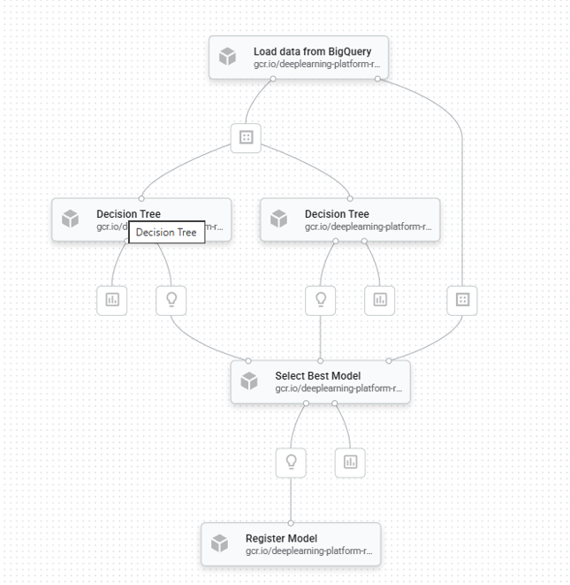


## Arquitectura


### Estructura del Proyecto  

La estructura de archivos de la aplicación consta de los siguientes elementos principales:
```text
gcp-pipeline-models/
├── .github/
│   └── workflows/            # Automatizaciones de integración continua (CI/CD)
├── src/                      # Código fuente principal de los modelos y pipelines
│   └── components/           # Componentes del proyecto
│   │   ├── data.py           # Limpieza y preparación de datos
│   │   ├── models.py         # Modelos de ML, Decision Tree y Random Forest
│   │   ├── evaluation.py     # Evaluación de la calidad de los modelos
│   │   └── register.py       # Registro en GCP
│   ├── pipeline.py           # DAG del workflow
│   └── requirements.txt      # Inventario de librerias
├── .gitignore                # Archivos omitidos en el control de versiones
├── .pre-commit-config.yaml   # Configuración de hooks de calidad de código
└── README.md                 # Documentación técnica y guía de arquitectura
```

### Workflow de CI/CD

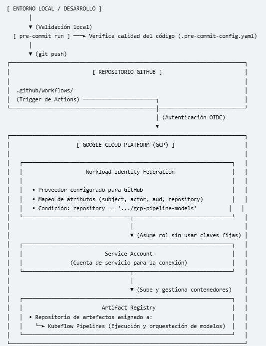

### Python Project

```bash
mkdir -p gcp-pipeline-models && cd gcp-pipeline-models
```

```bash
python3 -m venv venv-gcp-pipeline-models
source venv-gcp-pipeline-models/bin/activate
pip install pre-commit
pip install -r requirements.txt
```

```bash
pre-commit run --all-files
```

### Google Cloud Platform 
<!-- ## [Consola Google Cloud Platform](https://console.cloud.google.com/) -->

#### [Service Account](https://console.cloud.google.com/iam-admin/serviceaccounts)  
Creamos una cuenta de servicio para autorizar la ejecución  
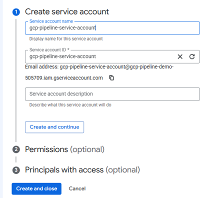  
Añadimos autorización a diferentes roles  
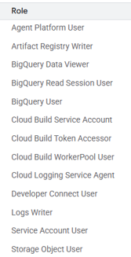  


#### [Workload Identity Federation](https://console.cloud.google.com/iam-admin/workload-identity-pools)  
Creamos una federacion para accesos externos  
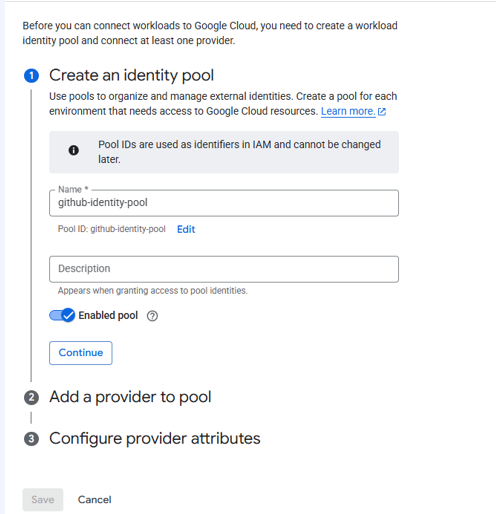  
Agregamos un proveedor para github  
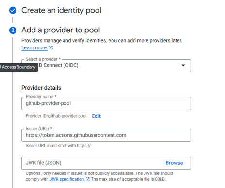  
Agregamos atributos  
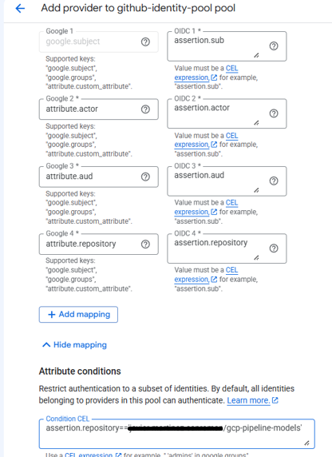  
Asociamos el Federation Pool al Service Account
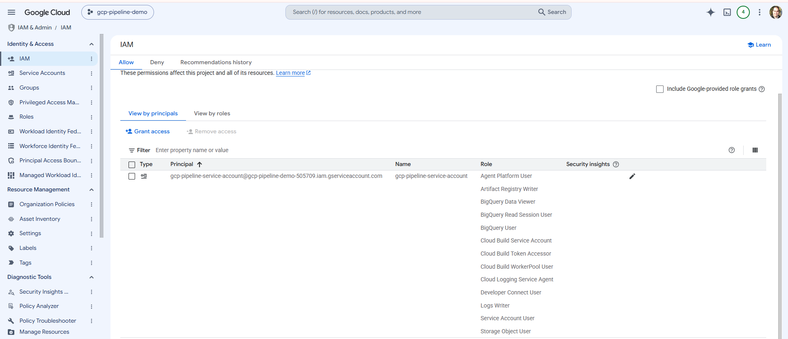  
    **Attribute mapping**

    - google.subject == assertion.sub
    - attribute.actor == assertion.actor
    - attribute.aud   == assertion.aud
    - attribure.repository == assertion.repository

    **Attribute conditions**

    - assertion.repository=='{github-account}/gcp-pipeline-models'  


#### [Artifact Registry](https://console.cloud.google.com/artifacts)
Creamos un repositorio para almacenar los artefactos del tipo Kubeflow Pipelines  
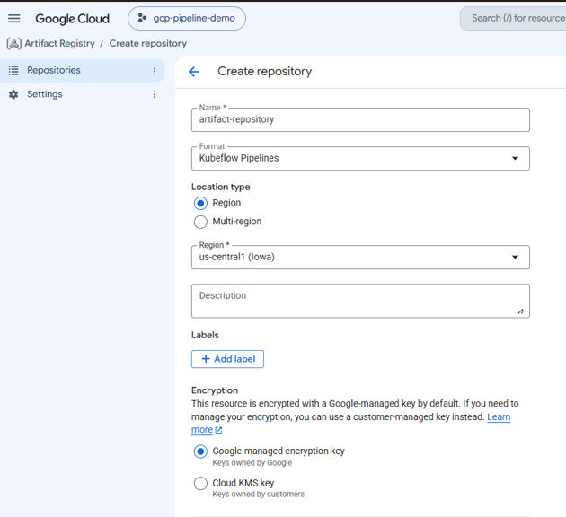  

## EJECUCIÓN DEL PIPELINE

Desde Artifact Registry, creamos una ejecución  
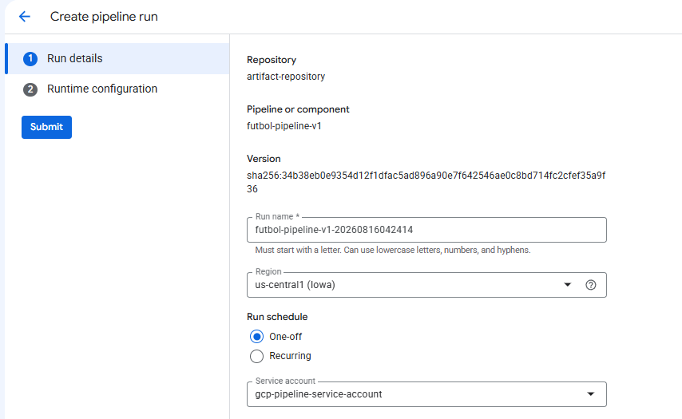  
Añadimos la localización del bucket para almacenar la información del pipeline.  
Inicializamos el workflow con los valores del dataset a modelizar  
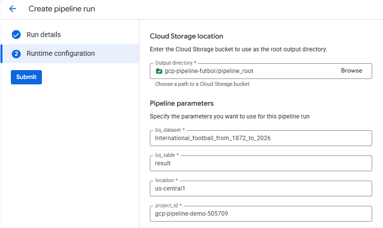  